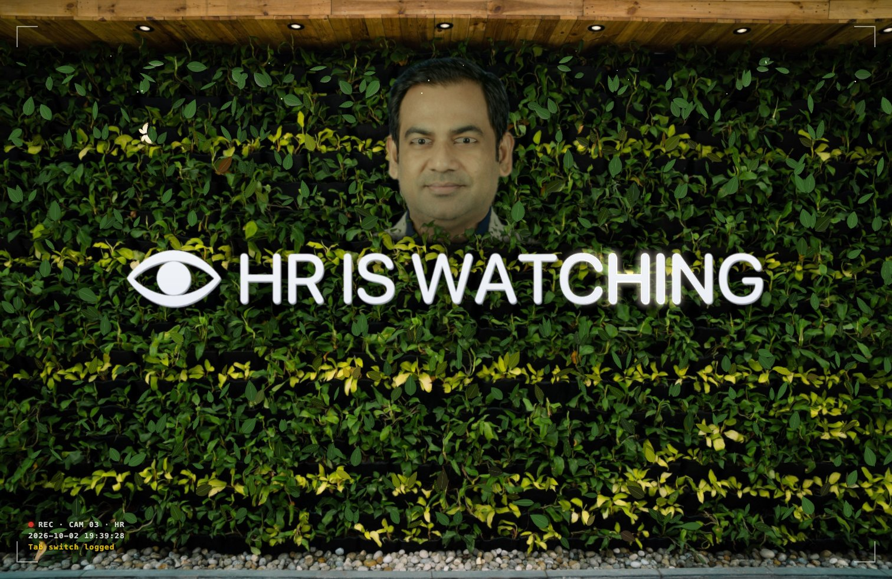
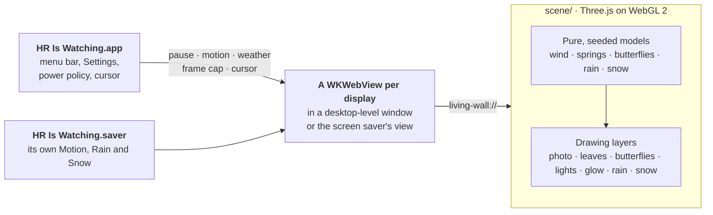

<div align="center">

# HR Is Watching

**The green wall, alive, as your Mac's desktop wallpaper and screen saver. HR has been in the hedge the whole time.**




[Install](#install) · [HR](#hr) · [Use](#use) · [Screen saver](#screen-saver) · [How it works](#how-it-works) · [FAQ](#faq) · [Develop](#develop)

</div>

A fork of Atanu Saha's [Cefalo Living Wall](https://github.com/Atanusaha143/cefalo-living-wall),
with the sign changed and someone from HR added. Everything else is the original: the leaves sway
in the breeze, gusts roll across the wall, leaves bend away from your cursor, butterflies drop by,
a light sweeps along the sign, and it can rain or snow.

```sh
git clone https://github.com/shihabcsedu09/cefalo-living-wall hr-is-watching
cd hr-is-watching
sh mac/install.sh
```

## HR

- **His eyes follow your cursor.** Anywhere on the desktop. Each eye looks at it on its own, so
  they converge when you hover between them.
- **He blinks,** every few seconds, and glances about when the cursor is off the wall, now and
  then straight at you.
- **He gets suspicious.** Leave the cursor still for 8 seconds and he narrows his eyes.
- **The wall is under surveillance.** A security-camera overlay in the corner shows REC, the time
  and HR's notes: "Lunch break: 47 min (noted)", "Reply-all detected", "Slack status 'Focusing':
  unverified". It notices when you idle for a minute, when it rains or snows, and when you put
  the cursor on his face. Add `?hud=0` to the scene's address to take it off.
- **The wind leaves him alone** (he is very still), no leaves grow over his face and no snow
  settles on it.

How: the sign and his head are part of the photo (`assets-src/hr/compose.py`, run by
`npm run photo`). His eyes are drawn again on top (`scene/src/watcher.js`): the whites, then each
iris, copied from where the photo has it and moved to where `scene/src/gaze.js` says he is looking,
then the lids.

## What it does

- **One wind for everything.** A breeze sways the photographed leaves and the modelled ones
  together, and every several seconds a gust rolls across the wall, overshoots and settles.
- **Leaves you can touch.** Move the cursor over the wall and the leaves bend away from it,
  flick as it brushes past and spring back with a little overshoot. Icons, clicks and dragging
  on the desktop work as usual.
- **Butterflies.** Now and then one, sometimes two, drop by, rest on a leaf and take off if the
  cursor comes close.
- **A light on the logo.** Every 11 seconds a light sweeps along CEFALO, and the wind eases in
  round the letters, so they stay crisp.
- **Rain and snow.** Three strengths of each, swelling and easing on their own. Snow settles on
  the leaves and melts after it stops. [More below](#weather).
- **A screen saver that keeps moving on the lock screen.** [More below](#screen-saver).
- **Every display.** Each gets its own wall, framed so the ceiling's downlights stay clear of
  the menu bar.
- **Easy on the battery.** At most 30 frames a second, 15 when windows cover most of the desktop,
  and nothing at all once it is covered, locked or asleep. [Measured](#power-and-memory).

## Install

You need macOS 13 or newer and the Xcode command line tools (`xcode-select --install`).
From the project folder:

```sh
sh mac/install.sh
```

The script:

1. builds the app and the screen saver, and renders a still of the wall's first frame (the photo
   with the leaves the scene adds);
2. checks that both run;
3. installs the app at `~/Applications/HR Is Watching.app` and the screen saver in
   `~/Library/Screen Savers`;
4. sets the still as your desktop picture (your current one is remembered);
5. starts the app now and at every login.

macOS may show a "background item added" notification. Rerun the same command to update: it
quits any copy that is still running, including one you opened by hand.

### Uninstall

```sh
sh mac/uninstall.sh
```

This stops the app (every running copy, including one you opened by hand), removes it, the
screen saver and the login item, clears a hot corner set from its Settings, and puts back your
previous desktop picture. Your settings are kept; `defaults delete local.hr-is-watching`
clears them.

## Use

Click the icon in the menu bar: Cefalo's three dots with two leaves opening from them. (The
app's own icon, in Finder and Login Items, is the same mark in Cefalo's colours.) The menu's
first line says what the wall is doing, or why it is not moving.

| Menu | What it does |
| --- | --- |
| **Pause / Resume** | Stops or starts the animation. |
| **Rain** | **Drizzle**, **Steady** or **Monsoon**, or **Off**. |
| **Snow** | **Flurries**, **Steady** or **Blizzard**, or **Off**. One weather at a time: choosing a snow mode stops the rain, and a rain mode stops the snow. |
| **Motion** | How fast and how far the leaves move: **Gentle**, **Lively** (the default) or **Wild**. It eases into a new level over about a second. |
| **Settings…** (⌘,) | The settings you set once: [Live Lock Screen](#live-lock-screen), and **Screen Saver Options…**, which opens System Settings where the [screen saver](#screen-saver) is chosen. |
| **Quit** | Closes it until you next log in. |

Every choice applies to every display and is remembered. Rain and Snow are Off until you choose
a mode.

### Weather

**Rain** builds up, then swells and eases on its own. A drizzle is a fine veil drifting in the
air, and the roof's edge only drips. Steady rain and a monsoon pour off the roof, knock and shake
the leaves and lean together in the gusts, and a monsoon greys the view behind a veil. The leaves
turn glossy and a mist dims the scene; they dry about a minute after it stops.

**Snow** drifts and tumbles, glows in the downlights and swirls in the gusts. Flurries come and
go in still air, and a blizzard drives small flakes sideways and whites out the view. The light
turns cold. Over a few minutes the snow settles on the leaves and the pebbles, always starting
from a bare wall, and CEFALO keeps a dark margin round its letters. A leaf shakes its snow off
when your cursor brushes it, a strong gust hits it or a butterfly takes off from it. Once the
snow stops it melts over about three minutes (sooner in rain), leaving the leaves wet.

Butterflies stay away while it rains or snows.

### Live Lock Screen

**Settings… ▸ Live Lock Screen** picks a hot corner, or **Off**. Moving the pointer into that
corner starts the screen saver, and your Mac locks behind it, so the lock screen shows the moving
wall. For the lock to follow at once, set System Settings ▸ Lock Screen ▸ Require password after
screen saver begins to Immediately.

- It is the living wall only where HR Is Watching is the chosen screen saver (for each
  display); elsewhere the corner starts whichever screen saver is chosen.
- Only one corner starts the screen saver. The pop-up shows it, even one set in System Settings,
  and **Off** clears it. A corner already used for something else (Quick Note, say) asks before
  it is replaced.
- The Dock restarts to take the change, which makes the screen flicker briefly.

## Screen saver

The first time the app starts it offers to open Screen Saver settings. Choose **HR Is
Watching** there: in System Settings → Wallpaper on macOS 26, which holds the screen savers, or in
System Settings → Screen Saver, under *Other*, on macOS 13–15. With more than one display, macOS
keeps a choice per display: pick the display at the top of that page and choose it for each one.
**Options…** next to it sets the screen saver's own Motion level (Lively by default) and its own
Rain or Snow (Off by default; one at a time).

While the screen saver runs, the wallpaper underneath rests; between runs nothing draws. When it
starts, the still of the wall shows at once and comes alive about two seconds later, fading into
the moving wall: macOS starts a fresh copy of the screen saver for each display, and the scene
takes that long to load. The still is the wall's own first frame, so only the motion changes.

It keeps playing on the lock screen. When the screen saver starts (after inactivity, from a hot
corner or with `open -a ScreenSaverEngine`), macOS 26 locks the Mac behind it and the wall goes
on moving until you wake it; it rests as soon as the displays sleep. Locking straight away (the
power button, ⌃⌘Q) shows the still instead, because macOS starts no screen saver then.

## How it works



The app puts one borderless window on each display at the desktop window level: above the
desktop picture, below the icons, and never taking a mouse event. Each window shows the bundled
scene in a web view. The screen saver shows the same scene, with its own settings.

**The photo moves with the same wind as the leaves.** A fragment shader draws the photo, looking
each pixel up a few units away: two drifting noise octaves, scaled by the breeze, the current
gust and a ripple round the cursor. The shader carries a GLSL copy of
[`wind.js`](scene/src/wind.js), so the photographed leaves and the modelled ones in front move as
one. Those leaves are a single instanced mesh posed in the vertex shader, each coloured from the
photo round its midpoint so it blends into the wall. Close to the letters the wind eases off,
which keeps CEFALO crisp.

**Models decide, layers draw.** Everything that changes over time is worked out by a small, pure
module, seeded wherever chance comes in: the gusts ([`wind.js`](scene/src/wind.js)), the leaves'
springs ([`leaf-springs.js`](scene/src/leaf-springs.js)), the butterflies' visits
([`butterfly-brain.js`](scene/src/butterfly-brain.js)), how hard it rains or snows
([`rain-weather.js`](scene/src/rain-weather.js), [`snow-weather.js`](scene/src/snow-weather.js))
and the snow each leaf holds ([`snow-loads.js`](scene/src/snow-loads.js)). The Three.js modules
only draw what those decide. So the same seed always grows the same wall, `?t=` replays any
instant exactly (the pictures in this README are made that way), and the unit tests run in plain
Node, with no browser.

**It draws only when someone can see it.** Every 1.5 seconds the app checks a 32 × 20 grid of
points on each display against the bounds of the windows over it, never their contents. A
display whose desktop is at least 40 % visible draws up to 30 frames a second, one at least 5 %
visible draws 15, and one covered beyond that draws nothing; none draws while the screen is
locked, asleep or behind the screen saver. A stopped scene schedules nothing at all. Below the
display's refresh rate the frame loop sleeps on a timer until just before the next frame is due,
instead of waking on every refresh (120 times a second on a MacBook Pro's XDR display).

**Offline by construction.** The scene reaches its web view over a private `living-wall://` URL
scheme (a `file://` page could neither import ES modules nor read the photo's pixels), and its
Content Security Policy allows no origin but its own. Three.js is bundled in `scene/vendor/`:
nothing is downloaded, and there is nothing to install.

**A still that matches.** The app renders the scene's first frame through WebKit, makes it the
desktop picture and gives it to the screen saver, which shows it while the scene loads and then
fades the moving wall in over it. Whether you see the still or the live wall, only the motion
differs.

## Power and memory

The moving wall costs about 5.5 W while you can see it, and nothing measurable once it stops.
Measured on 2 October 2026 on a 14-inch MacBook Pro (M2 Pro, 16 GB, macOS 26.7) on battery,
with its built-in display and a 1080p monitor, Low Power Mode off, Motion at Lively and the
cursor still. Each case ran for 1.5 to 3 minutes and is compared with the app quit, when the
whole Mac drew about 8.2 W:

| The wall | Frame rate | Extra power | Battery an hour | CPU | GPU busy | Memory |
| --- | --- | --- | --- | --- | --- | --- |
| In view: dry, Monsoon or Blizzard | 30 fps | 5–6 W | about 8 % | 0.8 of a core | 30–36 % | 690 MB |
| Mostly covered by windows | 15 fps | 2 W | about 3 % | 0.4 of a core | 13 % | 670 MB |
| Covered, paused, locked or asleep | none | none measurable | none | none | idle | 570 MB |

- **Extra power** is for the whole Mac, read from the battery's own gauge (±0.5 W). The CPU
  and GPU account for 1.5 W of it (`powermetrics`); the rest is spent elsewhere in the Mac
  while it draws.
- **Battery an hour** is that power as a share of the 70 Wh battery in a new 14-inch MacBook Pro.
- **CPU** counts one core as 1: the app and its WebKit processes take about 0.37 of a core, and
  WindowServer, which puts the wall on the screen, about 0.42 more. Together that is under a
  tenth of the M2 Pro's ten cores.
- **Memory** is Activity Monitor's figure for the app and its WebKit processes: about 390 MB for
  the built-in display's scene, 210 MB for the 1080p one and 90 MB for the rest. It stays loaded
  while the wall rests. A 4K display would need roughly 500 MB on its own (estimated from these
  two).

Rain and snow cost no more than a dry wall. Not measured: other Macs, 4K and 5K displays, the
screen saver, and Low Power Mode.

## Privacy

It reads the cursor position (so the leaves can react) and the positions of windows (to know how
much of the desktop is visible). Never window contents, never keystrokes. It needs no
Accessibility, Input Monitoring or Screen Recording permission, and makes no network requests.

## FAQ

<details>
<summary><b>Will it drain my battery?</b></summary>

Only while you can see it move. It draws at most 30 frames a second, 15 when windows cover most
of the desktop, and stops completely when the desktop is almost fully covered and while the
screen is locked or asleep. On a 14-inch MacBook Pro that is about 5.5 W (8 % of the battery an
hour) with the desktop in view, 2 W at 15 frames a second and nothing measurable once it stops;
see [Power and memory](#power-and-memory). It keeps running in Low Power Mode; pause it from the
menu if you want to save more.

</details>

<details>
<summary><b>Why is it not moving?</b></summary>

Open the menu: the first line says why (paused, covered by windows, screen locked or asleep,
screen saver running, scene failed to load). If Reduce Motion is on, it starts paused until you
choose Resume.

</details>

<details>
<summary><b>Where is the menu bar icon?</b></summary>

On a MacBook with a notch, macOS hides menu-bar icons that do not fit beside it. Quit or ⌘-drag
away another icon to make room.

</details>

<details>
<summary><b>What about multiple displays?</b></summary>

Each display gets its own wall. A screen wider than the photo, such as a 16:9 monitor, shows its
full width and crops mostly from the bottom, so the ceiling and its downlights stay clear of the
menu bar.

</details>

<details>
<summary><b>Can the lock screen move?</b></summary>

Yes, when the screen saver starts first: macOS locks behind it and the wall keeps moving. Locking
with the power button or ⌃⌘Q shows the still, because macOS starts no screen saver then. To lock
with the live wall, set up [Live Lock Screen](#live-lock-screen) and move the pointer into its
corner.

</details>

<details>
<summary><b>Something looks wrong?</b></summary>

This writes what the app and each display's scene are doing to
`~/Library/Logs/HR Is Watching.log`:

```sh
pkill -USR1 -f "HR Is Watching.app/Contents/MacOS/HR Is Watching"
```

The screen saver logs to the system log:

```sh
log show --last 10m --predicate 'subsystem == "local.hr-is-watching.saver"'
```

</details>

## Develop

Node.js 22 or newer; there is nothing to install.

```sh
npm start            # browser preview at http://127.0.0.1:8080/scene/
npm test             # unit tests
npm run smoke        # headless Chrome loads the scene and checks it draws
npm run test:mac     # host logic + the app and screen saver running in WebKit
npm run test:photo   # the maths that prepares the photo
npm run photo        # remake scene/assets/wall.jpg from the original photo
npm run media        # remake this README's pictures and build/reel.mp4 (needs Chrome, ffmpeg, Xcode tools)
```

In the browser preview, move the pointer over the leaves, and:

| Key | Does |
| --- | --- |
| Space | Pause or resume |
| 1, 2, 3 | Motion: Gentle, Lively, Wild |
| R | Step through the rain modes |
| S | Step through the snow modes |

| Add to the URL | To |
| --- | --- |
| `?debug` | Show the frame rate and frame time |
| `?t=12` | Freeze at 12 s |
| `?seed=3` | Grow a different wall |
| `?motion=3`…`5` | Start at a Motion level: Gentle, Lively, Wild |
| `?rain=1`…`3` | Start it raining: Drizzle, Steady, Monsoon |
| `?snow=1`…`3` | Start it snowing: Flurries, Steady, Blizzard |

They combine: `?t=200&snow=3` shows a wall snowed in.

```
scene/        the wall: index.html, src/ (a module per part), assets/wall.jpg, vendor/ (Three.js)
mac/          the app and the screen saver in Swift; build, install and uninstall scripts; tests
assets-src/   the original photo and the code that prepares it
tests/        unit tests (node:test) and the headless Chrome smoke test
media/        the pictures in this README, and render.mjs, which makes them
serve.mjs     the static server behind npm start
```

The photo the scene uses, `scene/assets/wall.jpg`, is made from the original
`assets-src/green-wall.jpg` by `npm run photo`: it scales it to 3840×2560, levels the
ceiling (the camera caught it sloping down to the right) and lifts the dark corners part
of the way. The command prints where the downlights ended up; copy that line into
`LIGHTS` in `scene/src/wall.js`.

## License

The code is under the MIT License ([LICENSE](LICENSE)). The photo of the green wall
(`assets-src/green-wall.jpg`, `scene/assets/wall.jpg` and the stills made from it, including the
animation and the weather pictures in `media/`) and Cefalo's name, logo and three-dot mark belong
to Cefalo and are not covered by that license; they are used here with Cefalo's permission.
The headshot of HR (`assets-src/hr/person.png` and HR's face in `scene/assets/wall.jpg`) is not
covered by the MIT License either; it is used with his permission.
Three.js 0.186.0 is bundled under its own MIT license (`scene/vendor/LICENSE`). The leaves in the
menu bar icon and the app's icon, and so in `media/icon.png`, the picture of that icon, are
Apple's `leaf.fill` symbol, drawn from the Mac's own symbols. Apple's terms do not allow its
symbols in app icons, so the app icon's leaves must be replaced before the app is shared publicly.
